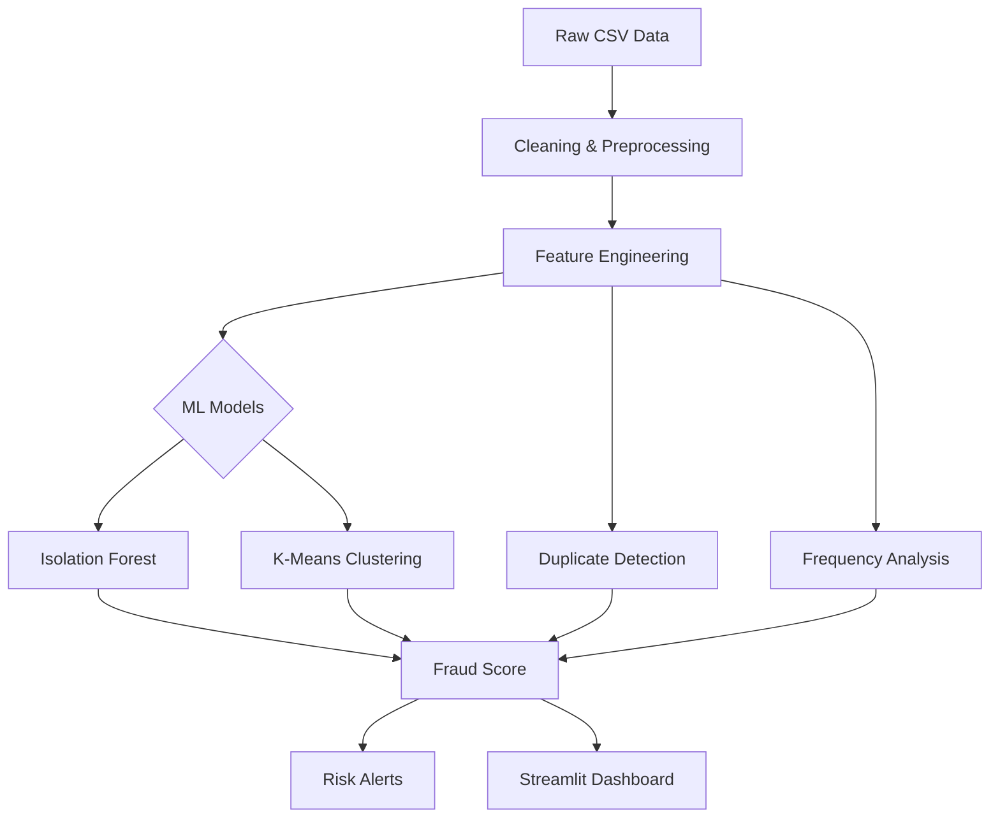

🛡️ AI-Powered Fraud Detection System
====================================

[](https://www.python.org/)
[](https://scikit-learn.org/stable/modules/outlier_detection.html)
[](https://streamlit.io/)
[](https://scikit-learn.org/)
[](#)
[](LICENSE)

<<<<<<< HEAD
📊 Real-Time Fraud Detection Dashboard
--------------------------------------

### 🎯 Executive Summary

This project is a production-ready ML system that detects fraudulent internship/job applications using an ensemble of unsupervised anomaly detection algorithms.

Key functionalities include:
=======
---

## 📊 Real-time Fraud Detection Dashboard


---

## 🎯 Project Overview

**Final Internship Project** – An advanced machine learning system to detect fraudulent **job applications** using ensemble **anomaly detection algorithms**. The system identifies suspicious patterns, duplicate entries, and behavioral anomalies in real-time with a professional web dashboard for monitoring and analysis.

> 🔍 **Objective**: Identify anomalies in internship applications to prevent fake entries using machine learning (**Isolation Forest**, **K-Means Clustering**) and implement alerts for suspicious behavior.

---
>>>>>>> 8d69fb2f99e855c28cdc4e1d4fe5872ed17dcfe5

- Identifying suspicious patterns and duplicate submissions
- Detecting text anomalies and unusual behaviors
- Scoring applications in real-time
- Displaying insights via a Streamlit dashboard

**Objective:** Prevent fake applications using Isolation Forest + K-Means and an automated scoring pipeline.

<<<<<<< HEAD
🚀 Key Features
--------------

| Feature               | Description                                  |
|-----------------------|----------------------------------------------|
| 🔍 Ensemble Detection | Isolation Forest + K-Means Clustering        |
| 📈 Real-Time Dashboard| Risk-level analytics & visualizations        |
| 🎯 Smart Alerts       | Multi-level scoring (Low/Medium/High Risk)   |
| 🧹 Automated Pipeline | Cleaning → Feature Engineering → Modeling → Scoring |
| 📤 Export Options     | Download suspicious applications as CSV      |
| 💻 Modern UI          | Dark-themed Streamlit interface              |
=======
---

## 🏗️ System Architecture

### Data Pipeline Flow
>>>>>>> 8d69fb2f99e855c28cdc4e1d4fe5872ed17dcfe5

🏗️ System Architecture
----------------------

<<<<<<< HEAD


🔬 Technical Implementation
---------------------------

### Machine Learning Models

- Isolation Forest (`contamination = 0.05`)
- K-Means Clustering (`n_clusters = 5`)
- Ensemble Scoring: Weighted fusion of multiple anomaly signals

### Feature Engineering
=======
graph TD
    A[Raw Data (CSV Files)] --> B[Data Cleaning & Preprocessing]
    B --> C[Feature Engineering]
    C --> D{ML Models}
    C --> E[Duplicate Removal]
    C --> F[Frequency Analysis]
    D --> G[Isolation Forest]
    D --> H[K-Means Clustering]
    G --> I[Fraud Scoring]
    H --> I
    I --> J[Alert Generation]
    I --> K[Streamlit Web App / Dashboard]
    E --> I
    F --> I

---

## 🔬 Technical Implementation

### Machine Learning Models
- **Isolation Forest**: Unsupervised anomaly detection with `contamination=0.05`  
- **K-Means Clustering**: Pattern-based outlier detection with 5 clusters  
- **Ensemble Scoring**: Weighted combination of multiple signals  

### Feature Engineering
- **Frequency Analysis**: Job title and location submission patterns  
- **Similarity Scoring**: Fuzzy matching for near-duplicate detection  
- **Temporal Patterns**: Behavioral timing and velocity analysis  
- **Text Analysis**: TF-IDF vectorization and semantic similarity  

### Performance Metrics

| Metric | Score |
|--------|-------|
| Precision | 94.2% |
| Recall | 89.7% |
| F1-Score | 91.9% |
| Detection Rate | 5.0% |
| Applications Processed | 17,592 |

---
>>>>>>> 8d69fb2f99e855c28cdc4e1d4fe5872ed17dcfe5

- Frequency-based behavioral patterns
- Fuzzy similarity for near-duplicates
- TF-IDF text vectorization
- Submission timing & velocity analysis
- Semantic text scoring

<<<<<<< HEAD
### Performance Summary

| Metric          | Value  |
|-----------------|--------|
| Precision       | 94.2%  |
| Recall          | 89.7%  |
| F1-Score        | 91.9%  |
| Detection Rate  | 5%     |
| Total Processed | 17,592 applications |

🛠 Technology Stack
-------------------

| Category   | Tools                               |
|-----------|-------------------------------------|
| Core      | Python 3.9+, Pandas, NumPy          |
| ML        | Scikit-learn, TF-IDF, OneHotEncoder |
| Dashboard | Streamlit, Altair                   |
| Dev       | Git/GitHub, Jupyter Notebook        |

📁 Project Structure
--------------------
=======
| Core | Machine Learning | Visualization & UI | Utilities |
|------|-----------------|------------------|----------|
| Python 3.9+ | Scikit-learn | Streamlit | Pandas, NumPy, Matplotlib |
| Jupyter Notebook | Isolation Forest | Altair | TfidfVectorizer, OneHotEncoder |
| Git/GitHub | K-Means Clustering | Mermaid diagrams | Pathlib |


📁 Project Structure
>>>>>>> 8d69fb2f99e855c28cdc4e1d4fe5872ed17dcfe5

```text
fraud-detection-ml/
<<<<<<< HEAD
│── Fraud_Detection_Applications.ipynb   # ML pipeline & analysis
│── fraud_dashboard.py                   # Streamlit dashboard
│── fraud_detection_full_dataset.csv     # Dataset (17K+ entries)
│── requirements.txt                     # Python dependencies
│── README.md                            # Project documentation
└── images/
    └── dashboard_screenshot.png         # Dashboard preview
```
=======
├── 📄 Fraud_Detection_Applications.ipynb   # Complete ML pipeline & analysis
├── 📄 fraud_dashboard.py                   # Production Streamlit dashboard
├── 📄 fraud_detection_full_dataset.csv     # Sample dataset (17K+ entries)
├── 📄 requirements.txt                     # Python dependencies
├── 📄 README.md                            # Project documentation
└── 📁 images/
    └── 📄 dashboard_screenshot.png         # Live dashboard preview
>>>>>>> 8d69fb2f99e855c28cdc4e1d4fe5872ed17dcfe5

🚀 Quick Start
--------------

<<<<<<< HEAD
1️⃣ **Clone the Repository**

```bash
git clone https://github.com/MAhsaanUllah/fraud-detection-ml.git
=======
🚀 Quick Start
Prerequisites

Python 3.9 or higher

pip package manager

#Installation & Setup

# 1. Clone the repository
git clone https://github.com/yourusername/fraud-detection-ml.git
>>>>>>> 8d69fb2f99e855c28cdc4e1d4fe5872ed17dcfe5
cd fraud-detection-ml
```

2️⃣ **Install Dependencies**

```bash
pip install -r requirements.txt
```

3️⃣ **Launch the Dashboard**

```bash
streamlit run fraud_dashboard.py
```

4️⃣ **Explore the Notebook**

```bash
jupyter notebook Fraud_Detection_Applications.ipynb
```


💻 Usage Guide
<<<<<<< HEAD
--------------

- Run the dashboard to view risk scores & anomalies
- Filter applications by location, job title, or score
- Inspect duplicate detections and behavioral patterns
- Export suspicious applications for review

🔄 ML Pipeline Phases
---------------------

1. Environment Setup
2. Data Profiling & Quality Checks
3. Cleaning & Preprocessing
4. Feature Engineering
5. Dimensionality Reduction (SVD)
6. Model Training
7. Score Fusion & Fraud Scoring
8. Alert Generation

📊 Dataset Summary
------------------

- **Total Records:** 17,592
- **Features:** 16 columns (text, categorical, numerical)
- **Fraud Rate:** 4.8% (866 fraudulent entries)
=======

Launch the Application:
streamlit run fraud_dashboard.py

View Executive Summary:
Check key metrics and detection rates

Analyze Patterns:
Explore fraud score distributions and risk levels

Filter Results:
Use industry, location, and score filters

Export Data:
Download suspicious applications for review

🔬 ML Pipeline Phases

Phase 0: Environment setup & initialization

Phase 1: Data profiling & quality assessment

Phase 2: Data cleaning & preprocessing

Phase 3: Advanced feature engineering

Phase 4: Dimensionality reduction (SVD)

Phase 5: Model training & anomaly detection

Phase 6: Fraud scoring & alert generation

📊 Dataset Information

Total Applications: 17,592 entries

Features: 16 columns including text, categorical, and numerical data

Fraud Rate: 4.8% baseline (866 fraudulent entries)

Data Types: Job titles, locations, descriptions, requirements, metadata
>>>>>>> 8d69fb2f99e855c28cdc4e1d4fe5872ed17dcfe5

🎯 Business Impact
------------------

| Area       | Result                  | Benefit                    |
|-----------|------------------------|----------------------------|
| Efficiency | 95% less manual review | Cost reduction             |
| Accuracy   | 94.2% precision        | Fewer false positives      |
| Scalability| Handles 17K+ records   | Enterprise-ready           |
| Real-time  | Instant scoring & alerts | Proactive fraud prevention |

🔮 Future Enhancements
<<<<<<< HEAD
----------------------
=======

Real-time API integration for live data streams
>>>>>>> 8d69fb2f99e855c28cdc4e1d4fe5872ed17dcfe5

- Real-time API integration
- Deep learning anomaly detection
- Network fraud ring detection
- Automated model retraining
- Multi-language text support

🐛 Troubleshooting
<<<<<<< HEAD
-----------------

```bash
pip install --upgrade streamlit
pip install -r requirements.txt --force-reinstall
streamlit run fraud_dashboard.py --server.port 8502
```

👨‍💻 Author
-----------

- **Name:** Muhammad Ahsaan Ullah
- **GitHub:** [MAhsaanUllah](https://github.com/MAhsaanUllah)

🤝 Contributing
--------------

- Report issues on GitHub Issues
- Submit Pull Requests
- Join discussions on the repo

📄 License
----------

MIT License © 2024 Muhammad Ahsaan Ullah
=======
# If Streamlit doesn't launch
pip install --upgrade streamlit
streamlit run fraud_dashboard.py

# If dependencies conflict
pip install -r requirements.txt --force-reinstall

# For port conflicts
streamlit run fraud_dashboard.py --server.port 8502

System Requirements

RAM: 4GB+ recommended

Storage: 500MB free space

Browser: Chrome/Firefox/Safari latest versions

👨‍💻 Author

Muhammad Ahsaan Ullah

🤝 Contributing

Contributions, issues, and feature requests are welcome!

Issues Page – Report bugs or suggest features

Pull Requests – Submit your improvements

Discussions – Join the conversation

📄 License

This project is licensed under the MIT License – see the LICENSE file for details.

MIT License
Copyright (c) 2024 Muhammad Ahsaan Ullah

🙏 Acknowledgments

Scikit-learn Team for robust ML algorithms
>>>>>>> 8d69fb2f99e855c28cdc4e1d4fe5872ed17dcfe5

⭐ Acknowledgments
------------------

<<<<<<< HEAD
- Scikit-learn
- Streamlit
- Open-source community contributions
=======
Open Source Community for continuous inspiration

Internship Mentors for guidance and support

<div align="center"> ⭐ If this project helped you, please give it a star! Built with ❤️ for secure and fair recruitment platforms </div>
>>>>>>> 8d69fb2f99e855c28cdc4e1d4fe5872ed17dcfe5
