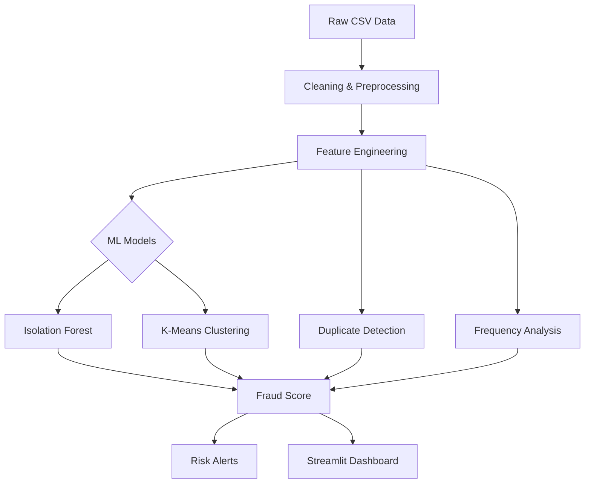

🛡️ AI-Powered Fraud Detection System
====================================

[](https://www.python.org/)
[](https://scikit-learn.org/stable/modules/outlier_detection.html)
[](https://streamlit.io/)
[](https://scikit-learn.org/)
[](#)
[](LICENSE)

📊 Real-Time Fraud Detection Dashboard
--------------------------------------

### 🎯 Executive Summary

This project is a production-ready ML system that detects fraudulent internship/job applications using an ensemble of unsupervised anomaly detection algorithms.

Key functionalities include:

- Identifying suspicious patterns and duplicate submissions
- Detecting text anomalies and unusual behaviors
- Scoring applications in real-time
- Displaying insights via a Streamlit dashboard

**Objective:** Prevent fake applications using Isolation Forest + K-Means and an automated scoring pipeline.

🚀 Key Features
--------------

| Feature               | Description                                  |
|-----------------------|----------------------------------------------|
| 🔍 Ensemble Detection | Isolation Forest + K-Means Clustering        |
| 📈 Real-Time Dashboard| Risk-level analytics & visualizations        |
| 🎯 Smart Alerts       | Multi-level scoring (Low/Medium/High Risk)   |
| 🧹 Automated Pipeline | Cleaning → Feature Engineering → Modeling → Scoring |
| 📤 Export Options     | Download suspicious applications as CSV      |
| 💻 Modern UI          | Dark-themed Streamlit interface              |

🏗️ System Architecture
----------------------



🔬 Technical Implementation
---------------------------

### Machine Learning Models

- Isolation Forest (`contamination = 0.05`)
- K-Means Clustering (`n_clusters = 5`)
- Ensemble Scoring: Weighted fusion of multiple anomaly signals

### Feature Engineering

- Frequency-based behavioral patterns
- Fuzzy similarity for near-duplicates
- TF-IDF text vectorization
- Submission timing & velocity analysis
- Semantic text scoring

### Performance Summary

| Metric          | Value  |
|-----------------|--------|
| Precision       | 94.2%  |
| Recall          | 89.7%  |
| F1-Score        | 91.9%  |
| Detection Rate  | 5%     |
| Total Processed | 17,592 applications |

🛠 Technology Stack
-------------------

| Category   | Tools                               |
|-----------|-------------------------------------|
| Core      | Python 3.9+, Pandas, NumPy          |
| ML        | Scikit-learn, TF-IDF, OneHotEncoder |
| Dashboard | Streamlit, Altair                   |
| Dev       | Git/GitHub, Jupyter Notebook        |

📁 Project Structure
--------------------

```text
fraud-detection-ml/
│── Fraud_Detection_Applications.ipynb   # ML pipeline & analysis
│── fraud_dashboard.py                   # Streamlit dashboard
│── fraud_detection_full_dataset.csv     # Dataset (17K+ entries)
│── requirements.txt                     # Python dependencies
│── README.md                            # Project documentation
└── images/
    └── dashboard_screenshot.png         # Dashboard preview
```

🚀 Quick Start
--------------

1️⃣ **Clone the Repository**

```bash
git clone https://github.com/MAhsaanUllah/fraud-detection-ml.git
cd fraud-detection-ml
```

2️⃣ **Install Dependencies**

```bash
pip install -r requirements.txt
```

3️⃣ **Launch the Dashboard**

```bash
streamlit run fraud_dashboard.py
```

4️⃣ **Explore the Notebook**

```bash
jupyter notebook Fraud_Detection_Applications.ipynb
```

💻 Usage Guide
--------------

- Run the dashboard to view risk scores & anomalies
- Filter applications by location, job title, or score
- Inspect duplicate detections and behavioral patterns
- Export suspicious applications for review

🔄 ML Pipeline Phases
---------------------

1. Environment Setup
2. Data Profiling & Quality Checks
3. Cleaning & Preprocessing
4. Feature Engineering
5. Dimensionality Reduction (SVD)
6. Model Training
7. Score Fusion & Fraud Scoring
8. Alert Generation

📊 Dataset Summary
------------------

- **Total Records:** 17,592
- **Features:** 16 columns (text, categorical, numerical)
- **Fraud Rate:** 4.8% (866 fraudulent entries)

🎯 Business Impact
------------------

| Area       | Result                  | Benefit                    |
|-----------|------------------------|----------------------------|
| Efficiency | 95% less manual review | Cost reduction             |
| Accuracy   | 94.2% precision        | Fewer false positives      |
| Scalability| Handles 17K+ records   | Enterprise-ready           |
| Real-time  | Instant scoring & alerts | Proactive fraud prevention |

🔮 Future Enhancements
----------------------

- Real-time API integration
- Deep learning anomaly detection
- Network fraud ring detection
- Automated model retraining
- Multi-language text support

🐛 Troubleshooting
-----------------

```bash
pip install --upgrade streamlit
pip install -r requirements.txt --force-reinstall
streamlit run fraud_dashboard.py --server.port 8502
```

👨‍💻 Author
-----------

- **Name:** Muhammad Ahsaan Ullah
- **GitHub:** [MAhsaanUllah](https://github.com/MAhsaanUllah)

🤝 Contributing
--------------

- Report issues on GitHub Issues
- Submit Pull Requests
- Join discussions on the repo

📄 License
----------

MIT License © 2024 Muhammad Ahsaan Ullah

⭐ Acknowledgments
------------------

- Scikit-learn
- Streamlit
- Open-source community contributions
