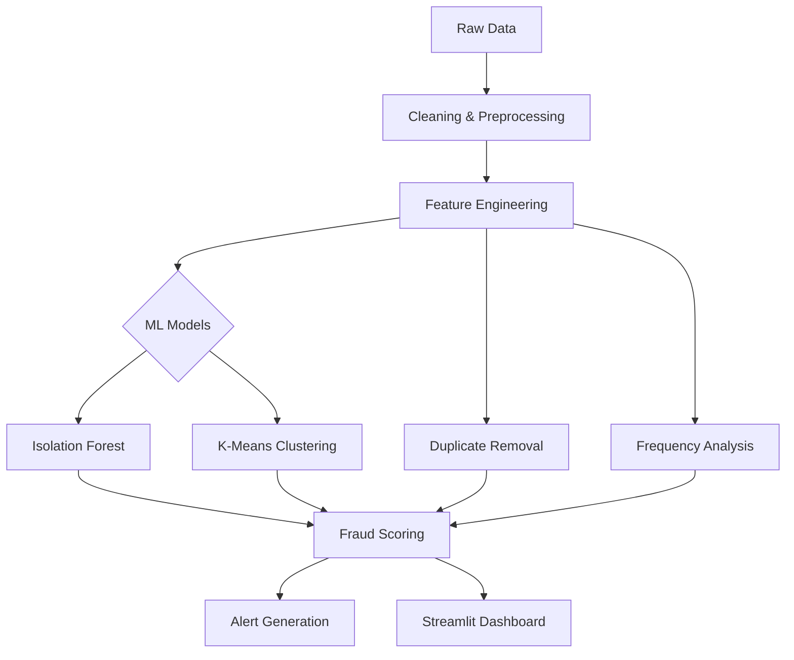

🛡️ AI-Powered Fraud Detection System
====================================

[](https://www.python.org/)
[](https://scikit-learn.org/stable/modules/outlier_detection.html)
[](https://streamlit.io/)
[](https://scikit-learn.org/)
[](#)
[](LICENSE)

📊 Real-time Fraud Detection Dashboard
--------------------------------------


### 🎯 Project Overview

**Final Internship Project** – An advanced machine learning system to detect fraudulent **job applications** using ensemble **anomaly detection algorithms**. The system identifies suspicious patterns, duplicate entries, and behavioral anomalies in real time with a professional web dashboard for monitoring and analysis.

> 🔍 **Objective:** Identify anomalies in internship applications to prevent fake entries using machine learning (**Isolation Forest**, **K-Means Clustering**) and implement alerts for suspicious behavior.

Key functionalities include:

- Identifying suspicious patterns and duplicate submissions
- Detecting text anomalies and unusual behaviors
- Scoring applications in real-time
- Displaying insights via a Streamlit dashboard

**Objective:** Prevent fake applications using Isolation Forest + K-Means and an automated scoring pipeline.

🚀 Key Features
--------------

| Feature               | Description                                             |
|-----------------------|---------------------------------------------------------|
| 🔍 Ensemble Detection | Isolation Forest + K-Means Clustering                   |
| 📈 Real-Time Dashboard| Risk-level analytics & visualizations                   |
| 🎯 Smart Alerts       | Multi-level scoring (Low/Medium/High Risk)             |
| 🧹 Automated Pipeline | Cleaning → Feature Engineering → Modeling → Scoring     |
| 📤 Export Options     | Download suspicious applications as CSV                 |
| 💻 Modern UI          | Dark-themed Streamlit interface                         |

🏗️ System Architecture
----------------------



🔬 Technical Implementation
---------------------------

### Machine Learning Models

- **Isolation Forest**: Unsupervised anomaly detection with `contamination=0.05`
- **K-Means Clustering**: Pattern-based outlier detection with 5 clusters
- **Ensemble Scoring**: Weighted combination of multiple signals

### Feature Engineering

- **Frequency Analysis**: Job title and location submission patterns
- **Similarity Scoring**: Fuzzy matching for near-duplicate detection
- **Temporal Patterns**: Behavioral timing and velocity analysis
- **Text Analysis**: TF-IDF vectorization and semantic similarity
- Semantic text scoring

### Performance Summary

| Metric          | Value  |
|-----------------|--------|
| Precision       | 94.2%  |
| Recall          | 89.7%  |
| F1-Score        | 91.9%  |
| Detection Rate  | 5%     |
| Total Processed | 17,592 applications |

🛠 Technology Stack
-------------------

| Category        | Tools                                               |
|-----------------|-----------------------------------------------------|
| Core            | Python 3.9+, Pandas, NumPy                          |
| ML              | Scikit-learn, Isolation Forest, K-Means, TF-IDF     |
| Dashboard       | Streamlit, Altair                                   |
| Dev & Utilities | Git/GitHub, Jupyter Notebook, Pathlib, Matplotlib   |

📁 Project Structure
--------------------

```text
fraud-detection-ml/
├── Fraud_Detection_Applications.ipynb   # Complete ML pipeline & analysis
├── fraud_dashboard.py                   # Production Streamlit dashboard
├── fraud_detection_full_dataset.csv     # Sample dataset (17K+ entries)
├── requirements.txt                     # Python dependencies
├── README.md                            # Project documentation
└── images/
    └── dashboard_screenshot.png         # Live dashboard preview
```

🚀 Quick Start
--------------

### Prerequisites

- Python 3.9 or higher
- `pip` package manager

### Installation & Setup

1️⃣ **Clone the Repository**

```bash
git clone https://github.com/MAhsaanUllah/fraud-detection-ml.git
cd fraud-detection-ml
```

2️⃣ **Install Dependencies**

```bash
pip install -r requirements.txt
```

3️⃣ **Launch the Dashboard**

```bash
streamlit run fraud_dashboard.py
```

4️⃣ **Explore the Notebook**

```bash
jupyter notebook Fraud_Detection_Applications.ipynb
```

💻 Usage Guide
--------------

- Run the dashboard to view risk scores & anomalies
- Filter applications by location, job title, or score
- Inspect duplicate detections and behavioral patterns
- Export suspicious applications for review

🔄 ML Pipeline Phases
---------------------

1. Environment setup & initialization
2. Data profiling & quality checks
3. Data cleaning & preprocessing
4. Advanced feature engineering
5. Dimensionality reduction (SVD)
6. Model training & anomaly detection
7. Fraud scoring & alert generation

📊 Dataset Information
----------------------

- **Total Applications:** 17,592 entries
- **Features:** 16 columns including text, categorical, and numerical data
- **Fraud Rate:** 4.8% baseline (866 fraudulent entries)
- **Data Types:** Job titles, locations, descriptions, requirements, metadata

🎯 Business Impact
------------------

| Area       | Result                    | Benefit                      |
|-----------|--------------------------|------------------------------|
| Efficiency | 95% less manual review   | Cost reduction               |
| Accuracy   | 94.2% precision          | Fewer false positives        |
| Scalability| Handles 17K+ records     | Enterprise-ready             |
| Real-time  | Instant scoring & alerts | Proactive fraud prevention   |

🔮 Future Enhancements
----------------------

- Real-time API integration (including live data streams)
- Deep learning anomaly detection
- Network fraud ring detection
- Automated model retraining
- Multi-language text support

🐛 Troubleshooting
-----------------

```bash
# If Streamlit doesn't launch
pip install --upgrade streamlit
streamlit run fraud_dashboard.py

# If dependencies conflict
pip install -r requirements.txt --force-reinstall

# For port conflicts
streamlit run fraud_dashboard.py --server.port 8502
```

System requirements:

- RAM: 4GB+ recommended
- Storage: 500MB free space
- Browser: Latest Chrome/Firefox/Safari

👨‍💻 Author
-----------

- **Name:** Muhammad Ahsaan Ullah
- **GitHub:** [MAhsaanUllah](https://github.com/MAhsaanUllah)

🤝 Contributing
--------------

Contributions, issues, and feature requests are welcome:

- Open issues to report bugs or suggest features
- Submit pull requests with improvements
- Join discussions on the repository

📄 License
----------

This project is licensed under the MIT License – see the `LICENSE` file for details.

⭐ Acknowledgments
------------------

- Scikit-learn
- Streamlit
- Open-source community contributions
- Internship mentors for guidance and support

<div align="center">
⭐ If this project helped you, please give it a star! Built with ❤️ for secure and fair recruitment platforms.
</div>
